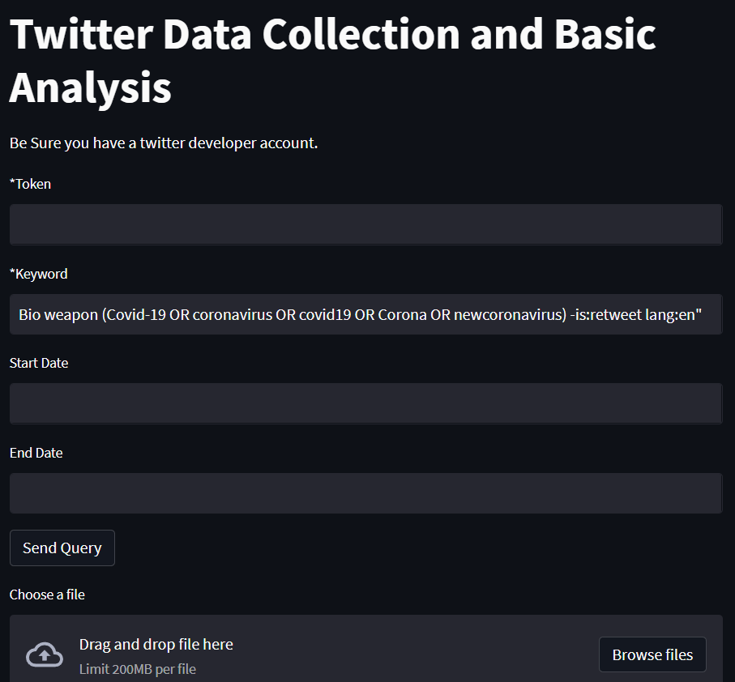
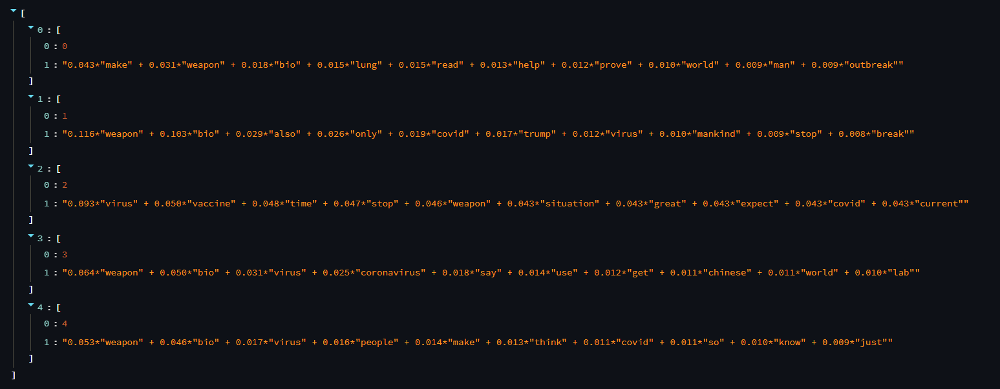
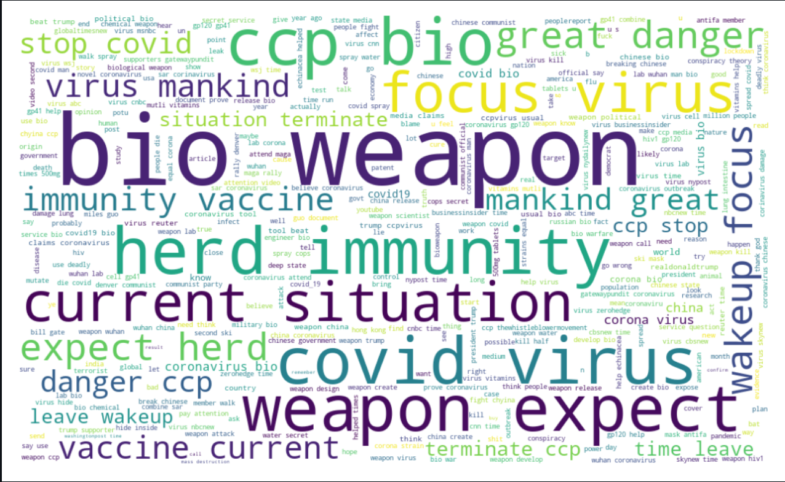
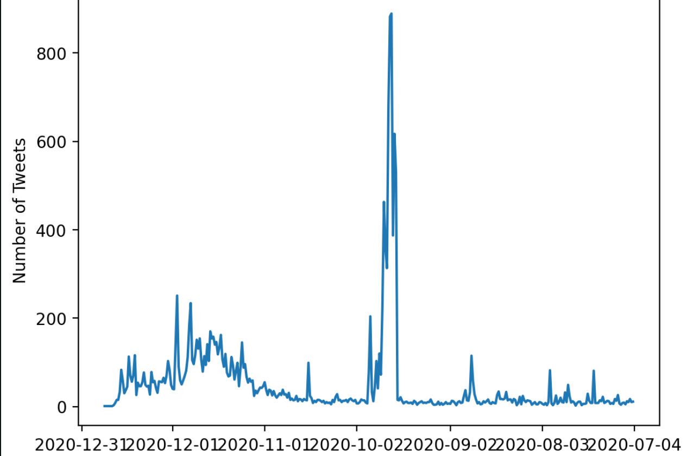

# Twitter Data Collection and Basic Analysis

## About

 The goal of this application to collect data using Twitter end API. Cleaning the data as required, Generating main topics, visualiza a nice word cloud and time graph of tweets of per day

## Used Library
- Python pandas, time, re, request
- Matplotlib
- Gensim
- Spacy 
- Streamlit

## Project Overview
After run the appliction an interface will visulize like below:
  
It's possible to collect data to fill up the required field but also possible to provide json file collected from Twitter API to execute the analysis further.
After having the required data the app will generate the main topics using Gensim LDA model. Below shows an example:
  
After Clicking on 'Generate Graph' app will show a beautiful word cloud and a time graph like below.
  
  

*If we see the output of the time graph we can easily see which period of time had more tweets or discussion about our searched topic.

## Limitation 
- User requied to have a access token from Twitter and the app will work for academic research.
- The application is shows only 5 topics but it's also possible to find the best coherence value for the given number of topics.

Finally Thank you for visiting.
